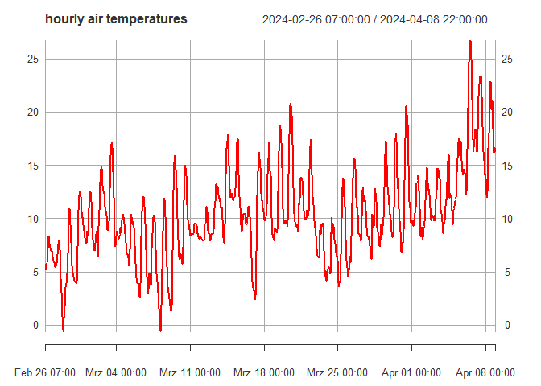

<!-- README.md is generated from README.Rmd. Please edit that file -->

# netatmo.weather

The goal of netatmo.weather is to provide access to Netatmo measurements
and station metadata making use of the Netatmo Weather API.

## Installation

You can install the development version of netatmo.weather with:

``` r
# install.packages("devtools")
devtools::install_github("dimfalk/netatmo.weather")
```

and load the package via

``` r
library(netatmo.weather)
#> 0.5.11
```

## Getting Started

### Authentication

In order to be able to access data, please follow the subsequent steps:

1)  Register a user account at
    [auth.netatmo.com](https://auth.netatmo.com/access/signup) and login
    at
    [dev.netatmo.com](https://auth.netatmo.com/de-de/access/login?next_url=https%3A%2F%2Fdev.netatmo.com%2F).

2)  Click on your username in the upper right corner and create a new
    application. Provide mandatory information (\*) and save.

3)  Credentials will be stored making use of `{keyring}`. In order to
    securely encrypt your secrets stored, it is necessary to define a
    vault password in your user-level `.Renviron`, which can be edited
    via `file.edit("~/.Renviron")` or by running
    `usethis::edit_r_environ()`. Create a new environment variable
    called `KEYRING_PASSWORD`.

The new line added now looks something like
`KEYRING_PASSWORD = "<insert_your_strong_password_here_123!>"`. You can
also create a password using e.g. `{sodium}` with
`keygen() |> bin2hex()`. Restart R to see changes. Eventually inspect
the key (privately) via `Sys.getenv("KEYRING_PASSWORD")`.

4)  Run `set_credentials()` and copy & paste the information necessary
    (id/secret), as supplied in 2) .

``` r
set_credentials()
#> Note: Keyring 'netatmo' successfully created.
```

5)  Run `fetch_token()` to create an Oauth 2 token based on the
    specifications provided in 4). When asked, whether you want to use a
    local file to cache OAuth access credentials between R sessions,
    choose “1: Yes”. You’ll be redirected to your browser to grant
    access to your application. Accept and close the browser tab.

``` r
fetch_token()
#> Note: OAuth 2.0 token successfully stored in file `.httr-oauth`.
```

Successful authentication is confirmed in the browser. Your token is now
stored to disk as `.httr-oauth` in your working directory.

In case you wanted to execute **/getpublicdata** and **/getmeasure** API
calls from your browser (for debugging reasons or whatever), you’ll need
to append your access token to your URL: `"&access_token=xxx"`. You’ll
also be notified if you try to execute requests with your access token
missing.

You can access your tokens consisting of a key and secret making use of
little helpers provided:

``` r
print_at()
#> "&access_token=62361e03ca18e13802546z20|5dt2091f1693dbff35f0428f2386b492"

print_rt()
#> "&refresh_token=62361e03ca18e13802546z20|6ce2fb2490a615d58b16e874fz4eb579"
```

Tokens expire after 3 hours and have to be refreshed again in order to
be used. `{netatmo.weather}` does so in the background automatically
without the user noticing. But if you’re using your access token in a
browser session temporarily, make use of these little helpers provided:

``` r
is_expired()
#> TRUE

refresh_at()
#> <Token>
#> <oauth_endpoint>
#>  authorize: https://api.netatmo.net/oauth2/authorize
#>  access:    https://api.netatmo.net/oauth2/token
#> <oauth_app> netatmo.weather
#>   key:    62361e03ca18e13802546z20
#>   secret: <hidden>
#> <credentials> scope, access_token, expires_in, expire_in, refresh_token

is_expired()
#> FALSE
```

### /getpublicdata

Queries via `get_publicdata()` to obtain station locations and metadata
require a user-defined bounding box as the main function argument. In
order to facilitate this, `get_extent()` was implemented to help you
out:

``` r
# using coordinates (xmin, ymin, xmax, ymax)
e1 <- get_extent(c(6.89, 51.34, 7.13, 51.53), epsg = 4326)
e1
#> Geometry set for 1 feature 
#> Geometry type: POLYGON
#> Dimension:     XY
#> Bounding box:  xmin: 6.89 ymin: 51.34 xmax: 7.13 ymax: 51.53
#> Geodetic CRS:  WGS 84
#> POLYGON ((6.89 51.34, 7.13 51.34, 7.13 51.53, 6...

# using municipality names
e2 <- get_extent("Essen")
e2
#> Geometry set for 1 feature 
#> Geometry type: POLYGON
#> Dimension:     XY
#> Bounding box:  xmin: 6.891972 ymin: 51.34647 xmax: 7.139793 ymax: 51.53627
#> Geodetic CRS:  WGS 84
#> POLYGON ((6.891972 51.34647, 7.139793 51.34647,...

# using postal codes
e3 <- get_extent("45145")
e3
#> Geometry set for 1 feature 
#> Geometry type: POLYGON
#> Dimension:     XY
#> Bounding box:  xmin: 6.952605 ymin: 51.44062 xmax: 7.001576 ymax: 51.45272
#> Geodetic CRS:  WGS 84
#> POLYGON ((6.952605 51.44062, 7.001576 51.44062,...
```

This information can now be used to list stations located in this area
(at the time of the query):

``` r
stations <- get_publicdata(ext = e1)
#> /getpublicdata: Fetching stations from the following area: 6.89, 51.34, 7.13, 51.53 ...

stations
#> Simple feature collection with 306 features and 13 fields
#> Geometry type: POINT
#> Dimension:     XY
#> Bounding box:  xmin: 6.890067 ymin: 51.34127 xmax: 7.129903 ymax: 51.52976
#> Geodetic CRS:  WGS 84
#> # A tibble: 306 × 14
#>    status time_server         NAMain      timezone country altitude city  street
#>  * <chr>  <dttm>              <chr>       <chr>    <chr>      <int> <chr> <chr> 
#>  1 ok     2024-04-03 23:11:57 70:ee:50:0… Europe/… DE           111 Essen A 52  
#>  2 ok     2024-04-03 23:11:57 70:ee:50:6… Europe/… DE           112 Essen Steel…
#>  3 ok     2024-04-03 23:11:57 70:ee:50:0… Europe/… DE           114 Essen Steel…
#>  4 ok     2024-04-03 23:11:57 70:ee:50:a… Europe/… DE           108 Essen Laure…
#>  5 ok     2024-04-03 23:11:57 70:ee:50:a… Europe/… DE           108 Essen Eligi…
#>  6 ok     2024-04-03 23:11:57 70:ee:50:0… Europe/… DE            60 Essen Hengl…
#>  7 ok     2024-04-03 23:11:57 70:ee:50:a… Europe/… DE            69 Essen Notte…
#>  8 ok     2024-04-03 23:11:57 70:ee:50:0… Europe/… DE            69 Essen Notte…
#>  9 ok     2024-04-03 23:11:57 70:ee:50:3… Europe/… DE            77 Essen Lohmü…
#> 10 ok     2024-04-03 23:11:57 70:ee:50:a… Europe/… DE           101 Essen Bochu…
#> # ℹ 296 more rows
#> # ℹ 6 more variables: mark <int>, n_modules <int>, NAModule1 <chr>,
#> #   NAModule2 <chr>, NAModule3 <chr>, geometry <POINT [°]>
```

However, since the number of stations returned by **/getpublicdata**
seems to be influenced by the size of the area queried, the logical
argument `tiles` was implemented, slicing your area of interest in tiles
à 0.05 degrees to be queried separately in order to ensure the maximum
number of available stations.

``` r
stations_tiled <- get_publicdata(ext = e1, 
                                 tiles = TRUE)
#> /getpublicdata: Fetching stations from the following area: 6.89, 51.34, 7.13, 51.53 ...

stations_tiled
#> Simple feature collection with 628 features and 13 fields
#> Geometry type: POINT
#> Dimension:     XY
#> Bounding box:  xmin: 6.890067 ymin: 51.34127 xmax: 7.129903 ymax: 51.52976
#> Geodetic CRS:  WGS 84
#> # A tibble: 628 × 14
#>    status time_server         NAMain      timezone country altitude city  street
#>    <chr>  <dttm>              <chr>       <chr>    <chr>      <int> <chr> <chr> 
#>  1 ok     2024-04-03 23:12:53 70:ee:50:8… Europe/… DE            45 Essen Volck…
#>  2 ok     2024-04-03 23:12:53 70:ee:50:7… Europe/… DE            46 Essen Eva-H…
#>  3 ok     2024-04-03 23:12:53 70:ee:50:a… Europe/… DE            63 Essen Am Mö…
#>  4 ok     2024-04-03 23:12:53 70:ee:50:a… Europe/… DE            93 Essen Senge…
#>  5 ok     2024-04-03 23:12:53 70:ee:50:1… Europe/… DE            48 Essen Johan…
#>  6 ok     2024-04-03 23:12:53 70:ee:50:a… Europe/… DE            57 Essen Marti…
#>  7 ok     2024-04-03 23:12:53 70:ee:50:1… Europe/… DE            81 Essen Akade…
#>  8 ok     2024-04-03 23:12:53 70:ee:50:7… Europe/… DE            61 Essen Haupt…
#>  9 ok     2024-04-03 23:12:53 70:ee:50:7… Europe/… DE            61 Essen Haupt…
#> 10 ok     2024-04-03 23:12:53 70:ee:50:7… Europe/… DE            66 Essen Eiche…
#> # ℹ 618 more rows
#> # ℹ 6 more variables: mark <int>, n_modules <int>, NAModule1 <chr>,
#> #   NAModule2 <chr>, NAModule3 <chr>, geometry <POINT [°]>
```

### /getmeasure

Queries via `get_measure()` to obtain station observations basically
require a base station MAC address to be queried (included in
`stations`), the parameter to be queried (e.g. `temperature`,
`humudity`, `sum_rain`, `...`), the measurement interval in minutes
(e.g. `5`, `30`, `60`) and a period encompassing the timestamp of the
first and last observation to retrieve in form of the local UNIX time in
seconds.

To assist you with the latter going backwards from `Sys.time()`,
`get_period()` exists:

``` r
# per default returning the maximum number of observations (1024) as a function of `res` chosen

# 5-minutely data
p1 <- get_period(res = 5)
as.POSIXct(p1, origin = "1970-01-01")
#> [1] "2024-03-31 09:40:00 CEST" "2024-04-03 23:00:00 CEST"

# hourly data
p2 <- get_period(res = 60)
as.POSIXct(p2, origin = "1970-01-01")
#> [1] "2024-02-21 06:00:00 CET"  "2024-04-03 23:00:00 CEST"

# querying the last 24 hours, maybe convenient for scheduled jobs
p3 <- get_period("recent")
as.POSIXct(p3, origin = "1970-01-01")
#> [1] "2024-04-02 23:00:00 CEST" "2024-04-03 23:00:00 CEST"

# self-defined period
p4 <- get_period(c("2024-03-01", "2024-04-01"))
as.POSIXct(p4, origin = "1970-01-01")
#> [1] "2024-03-01 CET"  "2024-04-01 CEST"
```

This can now be used to acquire observations (iterating over previously
identified stations) in form of listed `xts` objects. This might take
some time to finish.

``` r
# get subset of data for demonstration purposes
obs <- get_measure(devices = stations_tiled[1:10, ], 
                   period = p2, 
                   par = "temperature", 
                   res = 60)
#> /getmeasure: Fetching temperature measurements (60 min) from 2024-02-21 to 2024-04-03 for 10 station(s) ...

class(obs)
#> [1] "list"
length(obs)
#> [1] 10
names(obs)
#>  [1] "70:ee:50:84:48:5a" "70:ee:50:7a:81:24" "70:ee:50:af:62:5e"
#>  [4] "70:ee:50:af:86:16" "70:ee:50:12:f8:62" "70:ee:50:a4:68:a2"
#>  [7] "70:ee:50:16:0e:06" "70:ee:50:7f:f6:c8" "70:ee:50:7a:94:9a"
#> [10] "70:ee:50:7b:12:86"

# subset to individual xts object
xts <- obs[[1]]

class(xts)
#> [1] "xts" "zoo"

# inspect index/coredata
head(xts)
#> Warning: object timezone ('Europe/Berlin') is different from system timezone ('')
#>   NOTE: set 'options(xts_check_TZ = FALSE)' to disable this warning
#>     This note is displayed once per session
#>                     temperature
#> 2024-02-21 06:00:00         8.8
#> 2024-02-21 07:00:00         8.8
#> 2024-02-21 08:00:00         9.0
#> 2024-02-21 09:00:00         9.5
#> 2024-02-21 10:00:00         9.9
#> 2024-02-21 11:00:00        10.7

# inspect attribute names appended 
attributes(xts) |> names() |> tail(-4)
#>  [1] "STAT_ID"           "X"                 "Y"                
#>  [4] "Z"                 "CRS_EPSG"          "TZONE"            
#>  [7] "OPERATOR"          "SENS_ID"           "PARAMETER"        
#> [10] "TS_START"          "TS_END"            "TS_TYPE"          
#> [13] "MEAS_INTERVALTYPE" "MEAS_BLOCKING"     "MEAS_RESOLUTION"  
#> [16] "MEAS_UNIT"         "MEAS_STATEMENT"    "REMARKS"

plot(xts, main = "hourly air temperatures", col = "red")
```


